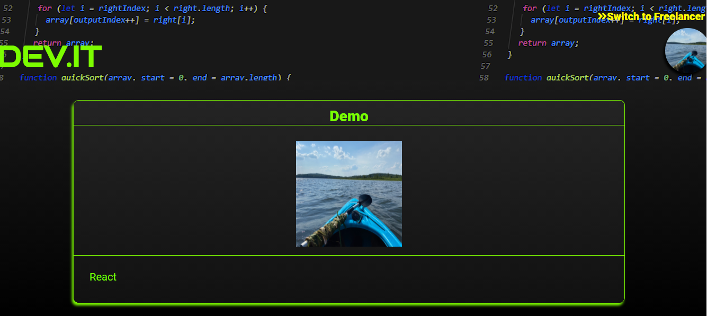

# Dev.it Client

This project was bootstrapped with [Create React App](https://github.com/facebook/create-react-app).

To see the live app click [here](https://capstone11.vercel.app/).

To try Dev.it without creating an account:

For a view of a freelance profile

Screen Name: DemoFreelancer
Password: password

This will take you to the freelancer offers page.  This is where any offers a business might send you will be located, giving you the ability to message the business about the offer or accept or deny it.

For a view of a business profile

Screen Name:  DemoBusiness
Password: password

This will take you to the business's dashboard where you can search for freelancers based on skills you need, view the resulting freelancers profiles, and make offers to those freelancers.

you can also look at any offers that you have previously made.  allowing you to view messages between that freelancer and yourself, see whether the offer was accepted/denied, or even delete the offer all together.  

## API documentation

To view the repo for the API used in this app click [here](https://github.com/ttilley02/devit).

## Summary

This app was created to connect businesses with freelancers to help with coding problems. With Dev.it the user can log in and if they are a business they can search for a freelancer by skill. If the user is a freelancer they can look at all of their offers and accept or deny them. When an offer is submitted the business and freelancer are able to message each other.

## Technology Used

The Dev.it client was created using React.js, JavaScript, CSS3 and icons were provided by FontAwesome.

## Available Scripts

In the project directory, you can run:

### `npm start`

Runs the app in the development mode. 
Open [http://localhost:3000](http://localhost:3000) to view it in the browser.

The page will reload if you make edits. 
You will also see any lint errors in the console.

### `npm test`

Launches the test runner in the interactive watch mode. 
See the section about [running tests](https://facebook.github.io/create-react-app/docs/running-tests) for more information.

### `npm run build`

Builds the app for production to the `build` folder. 
It correctly bundles React in production mode and optimizes the build for the best performance.

The build is minified and the filenames include the hashes. 
Your app is ready to be deployed!

See the section about [deployment](https://facebook.github.io/create-react-app/docs/deployment) for more information.

### `npm run eject`

**Note: this is a one-way operation. Once you `eject`, you can’t go back!**

If you aren’t satisfied with the build tool and configuration choices, you can `eject` at any time. This command will remove the single build dependency from your project.

Instead, it will copy all the configuration files and the transitive dependencies (webpack, Babel, ESLint, etc) right into your project so you have full control over them. All of the commands except `eject` will still work, but they will point to the copied scripts so you can tweak them. At this point you’re on your own.

You don’t have to ever use `eject`. The curated feature set is suitable for small and middle deployments, and you shouldn’t feel obligated to use this feature. However we understand that this tool wouldn’t be useful if you couldn’t customize it when you are ready for it.

## Learn More

You can learn more in the [Create React App documentation](https://facebook.github.io/create-react-app/docs/getting-started).

To learn React, check out the [React documentation](https://reactjs.org/).

### Code Splitting

This section has moved here: https://facebook.github.io/create-react-app/docs/code-splitting

### Analyzing the Bundle Size

This section has moved here: https://facebook.github.io/create-react-app/docs/analyzing-the-bundle-size

### Making a Progressive Web App

This section has moved here: https://facebook.github.io/create-react-app/docs/making-a-progressive-web-app

### Advanced Configuration

This section has moved here: https://facebook.github.io/create-react-app/docs/advanced-configuration

### Deployment

This section has moved here: https://facebook.github.io/create-react-app/docs/deployment

### `npm run build` fails to minify

This section has moved here: https://facebook.github.io/create-react-app/docs/troubleshooting#npm-run-build-fails-to-minify
